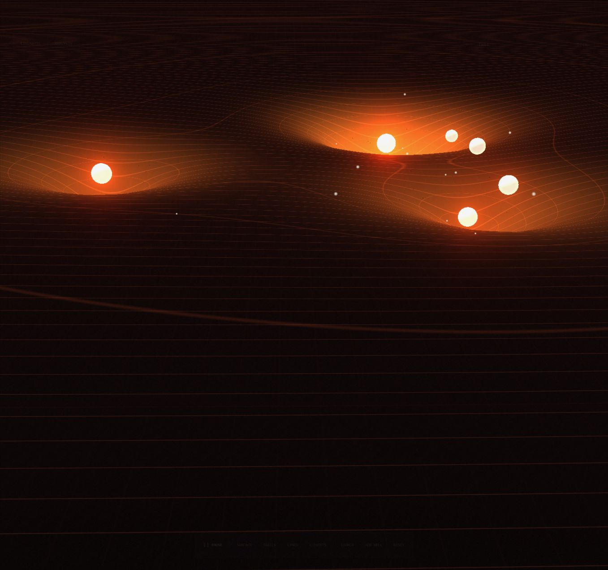
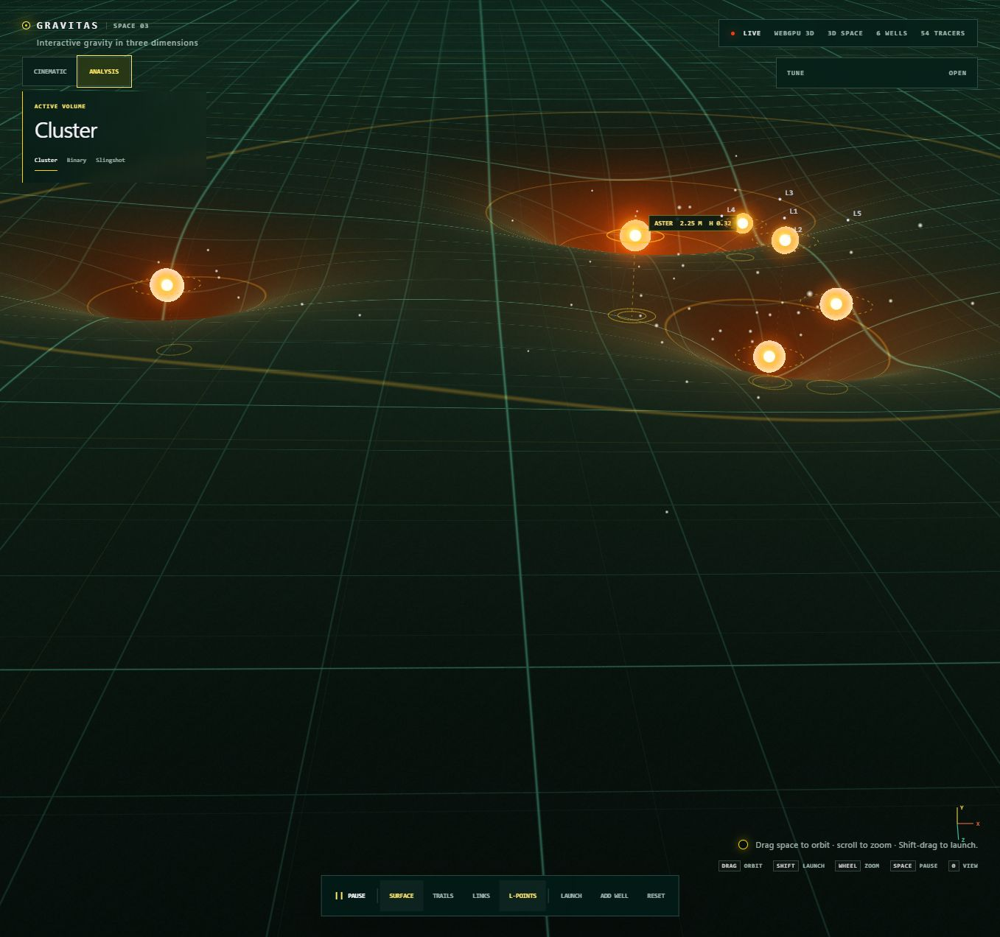

<div align="center">



# GRAVITAS

### Bend space. Release tracers. Watch gravity become geometry.

[](https://lorsabyan.github.io/gravity-viz/)
[](https://github.com/lorsabyan/gravity-viz/actions/workflows/deploy-pages.yml)


**[Launch the live simulation →](https://lorsabyan.github.io/gravity-viz/)**

</div>

Gravitas is an interactive, true-3D gravity-fabric experiment. A perspective WebGPU scene turns mass into luminous wells, spatial trajectories, orbiting particles, and a deformable field you can navigate in real time.

## What makes it different

| | Experience |
|---|---|
| **True spatial scene** | Perspective camera, bodies at different heights, surface-relative anchors, and 3D tracer trajectories. |
| **Cinematic + Analysis** | Move between a low-angle copper gravity fabric and an information-rich scientific view. |
| **Interactive physics** | Move wells, change their visual influence, launch tracers, pause time, and inspect Lagrange points. |
| **Real Solar System data** | All eight planets use Earth-mass values, AU distances, eccentricity, inclination, and Kepler-derived periods. |
| **Two distance models** | Compare a legible logarithmic full-system map with linear, true-ratio AU spacing. |
| **GPU-first rendering** | vGPU drives the WebGPU field shader, with a projected Canvas fallback when WebGPU is unavailable. |

## Two ways to see the field

<table>
  <tr>
    <td width="50%" align="center"><strong>Cinematic</strong></td>
    <td width="50%" align="center"><strong>Analysis</strong></td>
  </tr>
  <tr>
    <td></td>
    <td></td>
  </tr>
  <tr>
    <td>Dense copper threads, deep luminous bowls, restrained trajectories, and a near-horizon camera.</td>
    <td>Explicit 3D grid, body anchors, orbital elements, L-points, axis cues, and brighter trajectories.</td>
  </tr>
</table>

## Solar System model

The Solar System preset deliberately separates the physical model from the display model:

| Layer | Model |
|---|---|
| **Mass** | Stored in Earth masses; the Sun is `332,946 M⊕`. Mass maps logarithmically into bounded visual well strength. |
| **Distance** | Stored in astronomical units from Mercury at `0.387 AU` to Neptune at `30.07 AU`. |
| **Period** | Derived from mass and distance with Kepler's third law. |
| **Orbit** | Animated elliptical paths include eccentricity, inclination, ascending-node rotation, and distinct periods. |
| **Display** | Choose `LOG · FULL SYSTEM` for legibility or `LINEAR · TRUE RATIOS` to reveal the real spatial hierarchy. |

Body radius, well depth, and animation time are compressed so the entire system remains explorable on one screen. The physical values remain visible in the Tune panel.

## Controls

| Input | Action |
|---|---|
| Drag empty space | Orbit the perspective camera |
| Wheel / trackpad | Zoom |
| Drag a body | Move it across the field plane |
| Shift-drag | Aim and launch a 3D tracer |
| `Space` | Pause or resume |
| `A` | Toggle Analysis mode |
| `Z` | Enter or leave Zen mode |
| `R` | Reset the active simulation |
| `0` | Reset the camera |

The Tune panel exposes simulation sample, time rate, gravity, camera elevation, antialiasing, selected-body height, physical data, visual well strength, and Solar System distance mapping.

## Stack

```text
React 19 UI
   ├── vGPU / WebGPU fragment shader → warped field + luminous bodies
   ├── Canvas overlay               → trajectories + labels + spatial cues
   └── JavaScript simulation        → bodies + tracers + orbital model
```

- **React 19** for controls and application state
- **Vite 6** for development and production bundling
- **vGPU** for declarative WebGPU rendering
- **WGSL** for ray-surface intersection, field deformation, lighting, and grid rendering
- **GitHub Pages** for automatic deployment from `main`

## Run locally

```bash
pnpm install
pnpm dev
```

Open the URL printed by Vite in a WebGPU-capable browser.

## Verify the production build

```bash
pnpm build
pnpm test:sites
```

Every push to `main` also builds and publishes `dist/client` to GitHub Pages.
